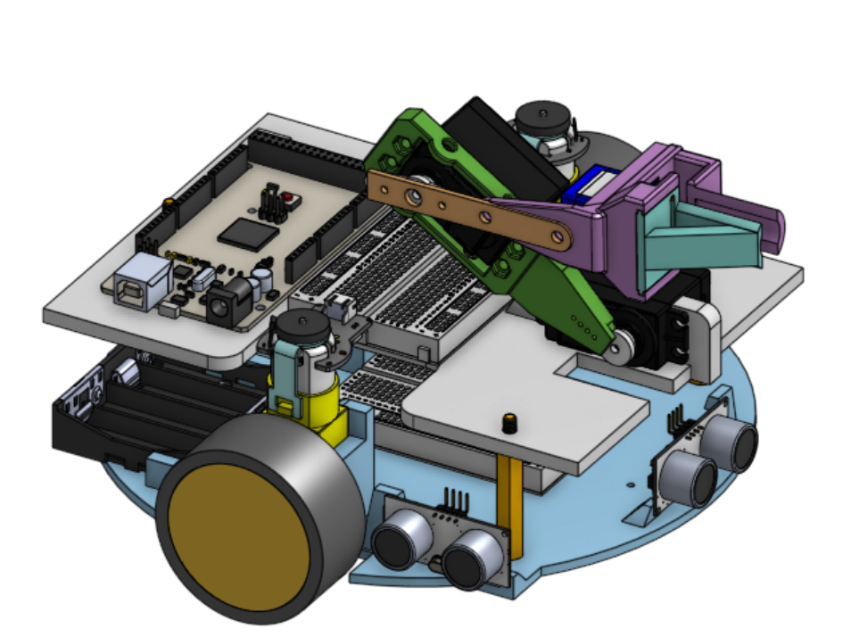

# ELE435 — Mechatronics Robot Challenge

> A fully autonomous mobile-manipulator robot designed and built for the ELE435 Mechatronics module Robot Challenge at the University of Sheffield (2025/26). The robot navigates a structured arena, draws on a whiteboard, passes through two tunnels, and drops a marker — all without human intervention.

---

## Demo

[Watch the run here (Youtube)](https://youtu.be/LvyPOBPngcs)

---

## The Challenge

The robot must complete a sequence of navigation and manipulation tasks across a 120 × 120 cm arena containing two 30 cm-wide tunnels and a whiteboard. Starting from a fixed position, it must:

1. Perform a 360° yaw rotation
2. Navigate through the **Right tunnel**
3. Draw on the whiteboard using a marker (manipulation task)
4. Navigate through the **Left tunnel**
5. Stop and drop the marker onto the floor

All motion must be fully autonomous — no human intervention permitted during a run.

---

## Robot Assembly

**CAD files:** [`master_assembly.step`](./master_assembly.step)
*(Designed in Onshape)*

---

## System Architecture

### Hardware

| Component | Purpose |
|---|---|
| Arduino Mega | Main microcontroller |
| TB6612FNG motor driver | DC motor control |
| 2× DC motors w/ quadrature encoders | Drivetrain |
| 2× HC-SR04 ultrasonic sensors (front + right) | Wall detection and navigation |
| 3× servo motors | 2-DOF robot arm + end-effector |
| Whiteboard marker | Manipulation end-effector |

### Software — State Machine
**Code:** [`master.ino`](./master.ino)
The robot is controlled by an 8-state finite state machine implemented in Arduino C++. Each state corresponds to a discrete phase of the task sequence.

| State | Description |
|---|---|
| `STATE_360TURN` | Performs a full 360° pivot in place using encoder-counted turns |
| `STATE_45TURN` | Executes a diagonal drive manoeuvre to touch the arena boundary (Checkpoint 3), then realigns toward the Right tunnel |
| `RT` | Navigates through the Right tunnel using front and right ultrasonic sensors for wall-following and collision avoidance |
| `WHITEBOARD` | Drives the 2-DOF servo arm to press the marker against the whiteboard and draw |
| `EXIT` | Pivots and navigates from the whiteboard toward the Left tunnel entrance |
| `LT` | Navigates through the Left tunnel with right-wall compensation |
| `DROP_PEN` | Lowers the arm and releases the marker onto the floor |
| `STOP` | Halts all motion |

### Navigation

- **Angle control:** Pivot turns are executed open-loop using quadrature encoder counts. The robot tracks encoder pulses and stops when the average of left and right counts reaches the target for the commanded angle.
- **Wall following:** Right-side ultrasonic sensor provides reactive correction — if the robot drifts too close to the right wall, a small corrective pivot is applied before resuming forward motion.
- **Tunnel traversal:** Front ultrasonic sensor detects the end wall to trigger state transitions at the correct position.

### Arm Control

The robot arm has two rotational joints (servo1, servo2) and a claw end-effector (servo3). Three pre-defined joint angle configurations are used:

| Configuration | servo1 | servo2 | servo3 | Purpose |
|---|---|---|---|---|
| Resting | 180° | 10° | 30° | Transit between tasks |
| Whiteboard | 75° | 135° | 30° | Marker contacts whiteboard |
| Drop | 20° | 180° | 75° | Marker released to floor |

---

## My Contributions

- Mechanical design from scratch (Onshape) and 3D printing of all custom components
- Component selection for drivetrain, sensors, and arm
- Electrical circuit assembly and debugging
- Arduino state machine implementation (`master.ino`)

---

## Files

| File | Description |
|---|---|
| `master.ino` | Full Arduino control code |
| `master_assembly.step` | CAD assembly (Onshape export) |

<!---
ELE435 Mechatronics Robot Challenge — University of Sheffield 2025/26
--->
